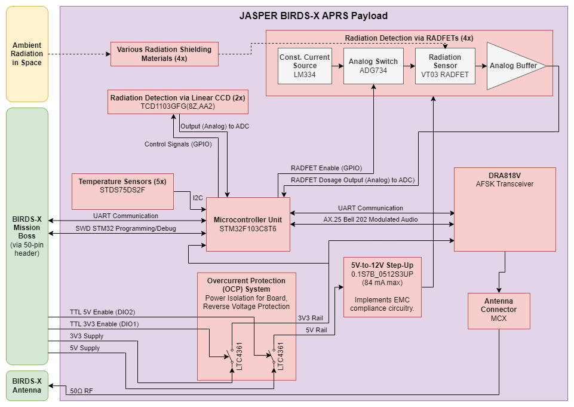

# JASPER BIRDS-X PCB
Repository for the PCB design for the JASPER BIRDS-X project.

JASPER is a joint organization between the University of Alberta's AlbertaSat and the University of Calgary's CalgaryToSpace cubesat teams.

## Features
1. Capable of APRS (Automated Packet Reporting System) digipeat and store-and-forward modes, and periodic beaconing, for use by Amateur Radio enthusiasts.
2. Implements a radiation experiment, which compares the radiation shielding properties of shielding options.
	* Uses RADFET sensors as radiation detection sensors.
	* Uses linear CCD sensor (painted black) to sense galactic cosmic rays.
3. Employs power safety systems (over-current protection, enable pins, etc.) to interface with the BIRDS-X satellite parent system.
4. Uses <300 mW on receive, and <1750 mW on transmit.
5. ~~Stores data in flash memory.~~
6. Interfaces with the Mission Boss system via UART.
7. A test fixture board makes flashing and debugging the main payload board easier and more reliable.

## System Block Diagram

## Release Notes
See the [GitHub Releases](https://github.com/AlbertaSat/BIRDS-X_PCB/releases) for this repo.

## License

This repository is licensed under the "CERN Open Hardware Licence Version 2 - Permissive (CERN OHL v2 Permissive)" license. For more information, see [the choosealicense.com description of the license](https://choosealicense.com/licenses/cern-ohl-p-2.0/).

> CERN OHL v2 Permissive
> A permissive license for hardware designs, with conditions only requiring preservation of notices. Contributors provide an express grant of patent rights. Licensed works, modifications, and larger works may be distributed under different terms and without sources.
